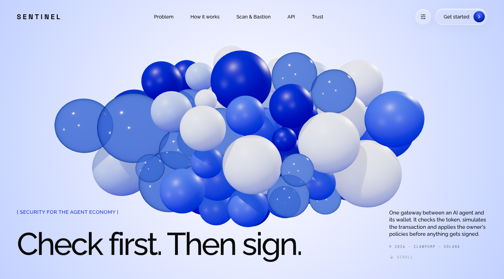
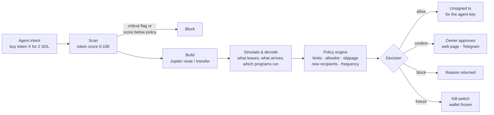
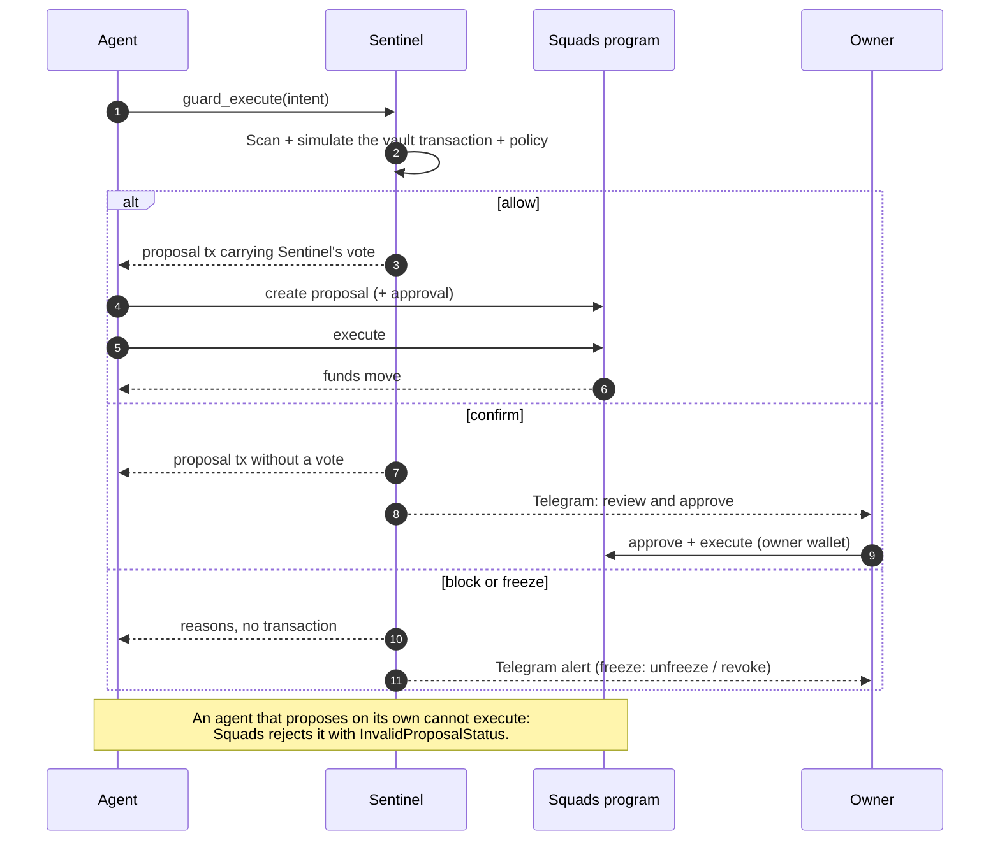

<div align="center">



# Sentinel

**The security gateway between an AI agent and its Solana wallet.**

Sentinel checks the token, simulates the transaction and applies the owner's policy before anything is signed. On a guarded wallet the rules are enforced on-chain: the agent cannot move funds without Sentinel's vote.

[](https://sentinel-clawpump.vercel.app)
[](https://www.npmjs.com/package/clawpump-sentinel)
[](https://github.com/0xNickdev/sentinel/actions/workflows/ci.yml)
[](LICENSE)
<br />
[](https://solana.com)
[](https://squads.so)
[](#model-context-protocol)
[](tsconfig.json)
[](https://clawpump.tech)

[Website](https://sentinel-clawpump.vercel.app) · [Quickstart](#quickstart) · [API](#api-reference) · [Architecture](docs/ARCHITECTURE.md) · [Security](SECURITY.md)

</div>

---

## Contents

- [Why Sentinel](#why-sentinel)
- [How it works](#how-it-works)
- [Features](#features)
- [Guarded wallets](#guarded-wallets)
- [Decision model](#decision-model)
- [Quickstart](#quickstart)
- [API reference](#api-reference)
- [Scan scoring rules](#scan-scoring-rules)
- [Bastion checks](#bastion-checks)
- [Self-hosting](#self-hosting)
- [Project structure](#project-structure)
- [Testing](#testing)
- [Security model](#security-model)
- [License](#license)

## Why Sentinel

AI agents now trade, launch tokens and move money on Solana with their own keys. That key will sign whatever the agent asks it to sign.

| Risk | What happens |
|---|---|
| **Scams at scale** | Thousands of launches a day. Bundles, snipers, dev dumps and honeypots are invisible in a DEX interface. |
| **Prompt injection** | Agents read tweets and token descriptions. One malicious line can make the key sign away the whole wallet. |
| **Piecemeal protection** | A token checker does not stop a transfer to the wrong address. Security has to cover the whole path. |
| **Blind signing** | Nobody shows the agent or its owner what a transaction will actually do before it is signed. |

Sentinel is one layer across that whole path, from the agent's decision to the money in the wallet.

## How it works

The agent calls `sentinel.execute(intent)` instead of signing directly. Everything else happens inside the gateway.



Every decision is logged with its reasons and the rules version that produced it, so the owner can see exactly why the wallet said no.

## Features

| Module | What it does |
|---|---|
| **Scan** | 0-100 risk score for any Solana token from live mainnet data: creator history, holder concentration and funding clusters, bundles and snipers, mint / freeze authority, liquidity and LP lock, a Jupiter sell test for honeypots, metadata impersonation. |
| **Bastion** | Simulates the exact transaction before signing and decodes balance changes, recipients and invoked programs. Applies the owner's policy and detects drainer patterns (token approvals to strangers, owner changes, account takeover). |
| **Gateway** | `sentinel.execute(intent)`: builds the transaction (Jupiter for swaps), runs Scan and Bastion, returns a decision and an unsigned transaction. Non-custodial: it never signs. |
| **Guard** | On-chain enforcement through a Squads v4 multisig. The agent can only propose, Sentinel can only approve, the owner keeps full control. A compromised agent cannot move funds. |
| **Kill-switch** | A drain attempt, a size spike or abnormal frequency freezes the wallet. The freeze persists until the owner lifts it with a signed message. |
| **Owner approval** | A review page and Telegram alerts with action buttons: approve, reject, unfreeze, revoke the agent. Every action is signed by the owner's own wallet. |
| **MCP server** | Eight tools over Streamable HTTP for Claude, Cursor, ClawPump and any MCP client. |
| **SDK** | [`clawpump-sentinel`](https://www.npmjs.com/package/clawpump-sentinel) on npm: one line to ask Sentinel, then sign and send only when allowed. |
| **Decision log** | Every verdict with reasons and rules version, stored in Postgres and queryable by wallet. |

## Guarded wallets

A guarded wallet is a [Squads v4](https://squads.so) multisig with three members and a threshold of one vote:

| Member | Initiate | Vote | Execute | Can it move funds alone? |
|---|:---:|:---:|:---:|---|
| **Owner** | ✓ | ✓ | ✓ | Yes. Full control, always. |
| **Agent** | ✓ | | ✓ | **No.** It has no vote. |
| **Sentinel** | | ✓ | | **No.** It cannot propose anything. |

The agent's transaction executes only after a vote, and the only votes belong to the owner and to Sentinel. Sentinel votes only for what passes Scan and Bastion. Refusing to vote is the kill-switch. This is enforced by the Squads program, not by Sentinel's server.



Verified on devnet with real transactions, including a bypass attempt where the agent proposed a drain directly in Squads and the program rejected the execution.

## Decision model

The strictest reason wins: `freeze` > `block` > `confirm` > `allow`.

| Decision | Meaning | Gateway returns | Guarded wallet |
|---|---|---|---|
| `allow` | Passed every check | Unsigned transaction | Sentinel votes, agent executes |
| `confirm` | Needs the owner, for example a new recipient | Unsigned transaction + flag | Proposal waits for the owner |
| `block` | Failed a check, for example a rug token or an over-limit trade | Reasons only | No vote |
| `freeze` | Looks like a compromised agent | Reasons only | Wallet frozen until the owner unfreezes |

In `warn` mode the same analysis runs and the decision is returned as a recommendation (`enforced: false`).

## Quickstart

### Model Context Protocol

Add the server as a custom connector in Claude, Cursor or any MCP client:

```
https://sentinel-clawpump.vercel.app/api/mcp
```

| Tool | Purpose |
|---|---|
| `scan_token` | Risk score for a token before buying it |
| `execute_intent` | Trade or transfer through Sentinel, returns decision + unsigned tx |
| `check_transaction` | Judge a transaction the agent built itself |
| `guard_setup` | Create a guarded wallet (owner signs) |
| `guard_execute` | Trade from a guarded wallet |
| `guard_finalize` | Execute an approved guarded transaction |
| `guard_status` | Members, balance, enforcement, freeze state |
| `decision_log` | Recent decisions with reasons |

### TypeScript SDK

```bash
npm i clawpump-sentinel @solana/web3.js
```

```ts
import { Sentinel } from 'clawpump-sentinel';

const sentinel = new Sentinel({ policy: { limits: { per_tx_sol: 2, per_day_sol: 10 } } });

const res = await sentinel.executeAndSend(
  { type: 'buy', wallet: agent.publicKey.toBase58(), mint, sol: 0.5 },
  agent,       // the agent's Keypair: Sentinel never sees it
  connection,
);
// signed and sent only when res.decision === 'allow'
```

Guarded wallet in one call per trade:

```ts
const run = await sentinel.guard.run({ multisig, intent: { type: 'buy', agent: agentKey.publicKey.toBase58(), mint, sol: 0.5 } }, agentKey, connection);
run.executed;     // true when Sentinel approved and it ran on-chain
run.approvalUrl;  // set when the owner must approve
```

### REST

```bash
curl -X POST https://sentinel-clawpump.vercel.app/api/execute \
  -H 'content-type: application/json' \
  -d '{
    "intent": { "type": "buy", "wallet": "<agent wallet>", "mint": "<token CA>", "sol": 0.5 },
    "policy": { "limits": { "per_tx_sol": 2, "per_day_sol": 10 }, "mode": "enforce" }
  }'
```

### Policy

```json
{
  "limits": { "per_tx_sol": 2, "per_day_sol": 10 },
  "programs": ["pump.fun", "jupiter"],
  "min_token_score": 60,
  "max_slippage_bps": 300,
  "new_recipient": "confirm",
  "max_tx_per_hour": 20,
  "recipients": [],
  "mode": "enforce"
}
```

Every field is optional and merged over these defaults (`GET /api/policy/default`).

## API reference

Base URL: `https://sentinel-clawpump.vercel.app`

| Method | Endpoint | Description |
|---|---|---|
| `GET` | `/api/scan/:mint` | Token risk score with flags and per-block breakdown |
| `POST` | `/api/execute` | `sentinel.execute(intent)`: decision + unsigned transaction |
| `POST` | `/api/bastion/check` | Judge a serialized transaction before signing |
| `POST` | `/api/guard/setup` | Create a guarded wallet (owner signs the returned tx) |
| `POST` | `/api/guard/execute` | Guarded intent: proposal with Sentinel's vote when allowed |
| `POST` | `/api/guard/finalize` | Execute transaction for an approved proposal |
| `POST` | `/api/guard/status` | Members, roles, balance, enforcement, freeze |
| `POST` | `/api/guard/proposal` | Decoded proposal with Bastion's analysis |
| `POST` | `/api/guard/approve` · `/reject` | Owner approval or rejection transaction |
| `POST` | `/api/guard/revoke` | Owner removes the agent (owner-side kill-switch) |
| `POST` | `/api/guard/unfreeze` | Lift a freeze with the owner's signed message |
| `GET` | `/api/journal?wallet=` | Decision log |
| `POST` | `/api/mcp` | MCP server (Streamable HTTP, stateless) |
| `GET` | `/api/health` | Service status |

Guard endpoints accept `"cluster": "devnet"` for testing. Errors are JSON `{ "error": "..." }` with `400` for bad input, `401/403` for authorization, `404` for missing accounts, `409` for state conflicts, `429` for rate limits and `502` when an upstream data source fails.

## Scan scoring rules

Rules version `scan-v1.0`. Seven blocks, 100 points.

| Block | Weight | Signals | Source |
|---|---:|---|---|
| Creator | 20 | Prior launches and dead-token rate, dev dump, wallet age | Helius DAS, DexScreener |
| Holders | 20 | Top-10 share excluding pools, burns and program vaults; largest wallet; clusters funded from one SOL source | Helius RPC, Enhanced Transactions |
| Bundles & snipers | 15 | Buyers in the creation block and the first three slots | Mint history |
| Authorities | 15 | Mint / freeze authority, mutable metadata, dangerous Token-2022 extensions | RPC, DAS |
| Liquidity | 15 | Depth on a log scale, LP lock (pump.fun curve, PumpSwap) | pump.fun curve, DexScreener |
| Trading anomalies | 10 | Jupiter sell test (honeypot), wash trading, crashes and spikes | Jupiter, DexScreener |
| Metadata | 5 | Reachable metadata, socials, ticker impersonation | IPFS, DexScreener |

Critical flags block regardless of score: active mint authority, active freeze authority, permanent delegate, non-transferable, pausable, frozen-by-default, no sell route, liquidity under $500. A failing data source never fails the scan: the block gets half weight and an `insufficient_data` flag.

## Bastion checks

| Check | Decision |
|---|---|
| Simulation fails | `block` |
| Token approval to a stranger, token-account owner change, wallet reassignment | `block`, regardless of policy |
| Program outside the allowlist | `block` |
| Trade above `per_tx_sol`, 24h spend above `per_day_sol` (from on-chain history) | `block` |
| Received token has a critical Scan flag or scores below `min_token_score` | `block` |
| Actual slippage against a fresh Jupiter quote above `max_slippage_bps` | `block` |
| Transfer to an address the wallet never paid before | `new_recipient`: `confirm` / `block` / `allow` |
| Amount above 5× the limit, draining ≥ 90% of the balance, frequency at `max_tx_per_hour` | `freeze` |

Fees and rent are separated from trade value, so they never read as slippage.

## Self-hosting

```bash
git clone https://github.com/0xNickdev/sentinel.git && cd sentinel
npm install
cp .env.example .env    # fill in the values below
npm start               # API + website on http://127.0.0.1:8787
```

| Variable | Required | Purpose |
|---|:---:|---|
| `HELIUS_API_KEY` | ✓ | Solana RPC, DAS and Enhanced Transactions ([helius.dev](https://helius.dev)) |
| `SENTINEL_APPROVER_SECRET` | for Guard | Sentinel's vote-only key (base58). It cannot propose or move funds. |
| `DATABASE_URL` | recommended | Postgres for the decision log, shared cache, rate limits, freezes, Telegram links. In-memory fallback without it. |
| `TELEGRAM_BOT_TOKEN` | optional | Owner alerts and the `/check` bot |
| `PUBLIC_URL` | optional | Base URL used in approval links |

Deploy to Vercel:

```bash
npm run build:vercel   # bundles the API into api/index.mjs
vercel deploy --prod
```

## Project structure

```
src/
├── scan/          token risk engine: context, seven scoring blocks, orchestrator
├── bastion/       simulation, decoder, policy engine, wallet history
├── gateway/       sentinel.execute(intent), decision journal
├── guard/         Squads guarded wallets, approvals, freezes
├── mcp/           MCP server and tools
├── notify/        Telegram alerts and bot commands
├── lib/           RPC and market clients, Postgres, cluster context
├── app.ts         HTTP API (Fastify)
├── server.ts      local server
└── vercel.ts      serverless entry
public/            website and owner approval page
sdk/               clawpump-sentinel npm package
scripts/           end-to-end and devnet verification
docs/              architecture notes
```

## Testing

| Command | What it verifies |
|---|---|
| `npm run typecheck` | Strict TypeScript across the codebase |
| `npm run e2e` | Nine gateway scenarios on mainnet data (simulation only, nothing is sent) |
| `npm run guard:devnet` | Guarded wallet with real devnet transactions: allowed transfer, injection freeze, persistent freeze and unfreeze, owner approval, bypass attempt rejected on-chain, agent revocation |
| `npm run mcp:check` | The MCP server through the official MCP client |
| `npm run scan -- <mint>` | Score any token from the terminal |

All scripts accept `API=<url>` to run against a deployment.

## Security model

- **Non-custodial.** Sentinel never holds a private key that can move funds. The gateway returns unsigned transactions, and Sentinel's guard key can only vote.
- **On-chain enforcement.** On guarded wallets the vote requirement is enforced by the Squads program. Sentinel's server going down blocks the agent, never the owner.
- **Owner supremacy.** The owner can approve, execute, revoke the agent and withdraw at any time without Sentinel.
- **Explainable.** Every decision carries its reasons and rules version and is written to the decision log.
- **Fail-safe data.** Upstream failures degrade a single scoring block instead of producing a false verdict.

See [SECURITY.md](SECURITY.md) for the threat model and how to report a vulnerability.

## License

[MIT](LICENSE)

<sub>Scores and decisions are risk indicators, not financial advice.</sub>
