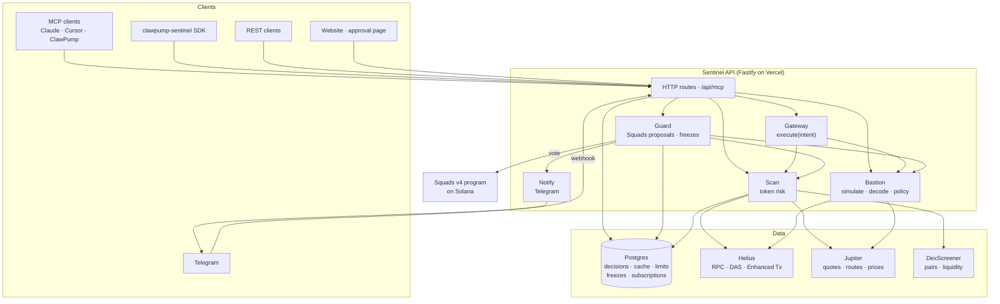

# Architecture

## System overview

## Request lifecycle: `execute(intent)`

1. **Validate** the intent and merge the caller's policy over the defaults.
2. **Scan** the target token in parallel with **building** the route, so a bad token short-circuits before routing finishes.
3. **Simulate** the built transaction with `simulateTransaction` (`replaceRecentBlockhash`, inner instructions, post-state of every touched account).
4. **Decode** SOL and token deltas for the wallet, separating fees and rent from trade value; normalize raw and pre-parsed inner instructions into events (transfers, approvals, authority changes, account creation).
5. **Apply policy**: program allowlist, per-trade and daily limits (daily spend from on-chain history), received-token scores, slippage against a fresh quote, new recipients, kill-switch conditions.
6. **Decide** with the strictest reason winning, log it with reasons and rules version, return an unsigned transaction only when sendable.

## Guarded wallet lifecycle

| Step | Who signs | On-chain effect |
|---|---|---|
| Setup | Owner (+ an ephemeral create key) | Squads multisig: owner (all), agent (initiate + execute), Sentinel (vote), threshold 1. Optional vault funding. |
| Allowed trade | Agent (+ Sentinel's vote in the same tx) | Vault transaction + proposal + approval, then execute |
| Needs owner | Agent, then owner | Proposal waits; the owner approves and executes in one transaction |
| Freeze | Nobody | Sentinel withholds its vote until the owner signs an unfreeze message |
| Revoke | Owner | Config transaction removes the agent; pending proposals go stale |

Swaps from a vault use Jupiter routes capped by account count (30, then 24, then 18) so the proposal fits a single Solana transaction.

## Scan internals

A per-request `ScanContext` memoizes shared inputs (mint account, DAS asset, mint history, DexScreener pairs, pump.fun bonding curve) so the seven blocks never repeat a request. Blocks run in parallel under a per-block timeout; a failing block degrades to half weight instead of failing the scan. Results are cached in memory and in Postgres, so a cold serverless instance reuses a recent scan from another instance.

Holder analysis classifies owners before scoring:

| Owner type | Treatment |
|---|---|
| Pool program PDA or known pool authority | Liquidity, excluded |
| Burn address | Excluded |
| Other off-curve address (PDA) | Program vault: locker, multisig, platform agent. Reported separately |
| On-curve wallet | Counted toward concentration and funding clusters |

## Persistence

| Table | Purpose |
|---|---|
| `decisions` | Decision log, indexed by wallet and time |
| `scan_cache` | Shared scan results with TTL |
| `rate_limits` | Fixed-window per-IP counters |
| `freezes` | Persistent kill-switch state per wallet and cluster |
| `tg_subscriptions` | Telegram chats linked to guarded wallets |

Without `DATABASE_URL` every store falls back to process memory for local development.
